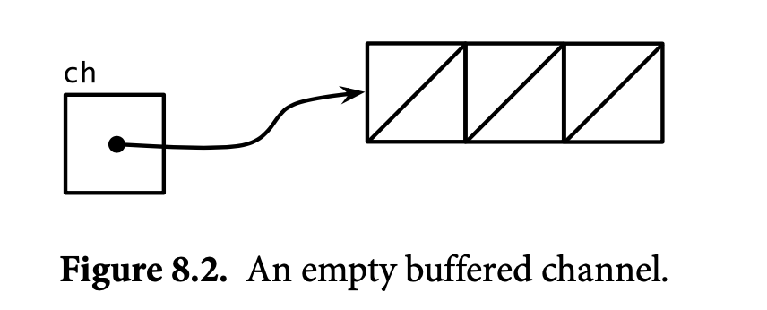
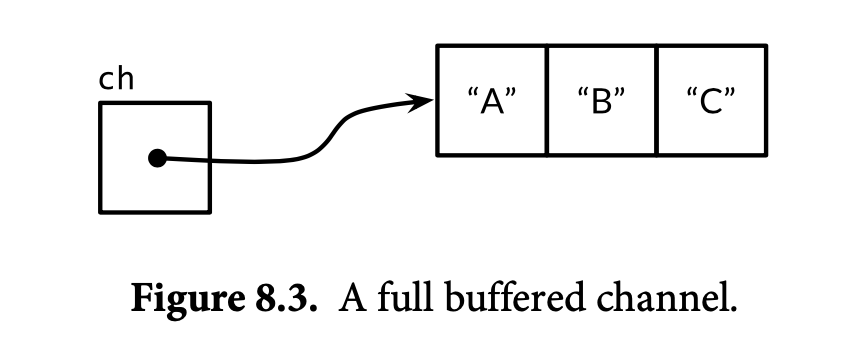
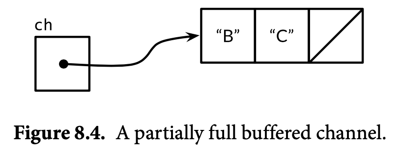

# Go

## Table of Contents

- [1. Basic](#1-basic)
	- [1.1 Execution](#11-execution)
	- [1.2 Variables](#12-variables)
		- [1.2.1 Zero-value Mechanism](#121-zero-value-mechanism)
		- [1.2.2 Lifetime](#122-lifetime)
	- [1.3 Type](#13-type)
	- [1.4 Slices](#14-slices)
	- [1.6 Maps](#16-maps)
	- [1.5 Structs](#15-structs)
- [2. Concurrency](#2-concurrency)
	- [2.1 Goroutines](#21-goroutines)
	- [2.2 Channels](#22-channels)
	- [2.3 Race Conditions](#23-race-conditions)
- [References](#references)

## 1. Basic

### 1.1 Execution

**The order of execution**

<div align="center">  </div><br>

1. 入口：*package main*，按顺序 *import* 所有包
2. 递归地 *import*（每个包只会 *import* 一次）
3. 所有 *const* 和 *variables* 将被赋值，调用 *init()*（若存在）
4. 执行 *main()*

**init 函数**

```go
var WhatIsThe = AnswerToLife()

func AnswerToLife() int {
    return 42
}

func init() {
    WhatIsThe = 0
}

func main() {
    if WhatIsThe == 0 {
        fmt.Println("It's all a lie.")
    }
}
```

### 1.2 Variables

#### 1.2.1 Zero-value Mechanism

```go
var name type = expression
```


|                             Type                             | Zero-value |
| :----------------------------------------------------------: | :--------: |
|                           Numbers                            |     0      |
|                           Booleans                           |   False    |
|                           Strings                            |     ""     |
|                          Interface                           |    nil     |
| Reference types<br />(slice, pointer, map, channel, function) |    nil     |

#### 1.2.2 Lifetime

// todo


### 1.3 Type

```go
type name underlying-type
```


### 1.4 Slices

- *len(sl) == 0* 判断是否为空
- 不可比较

**结构**

<div align="center">  </div><br>


<div align="center">  </div><br>


<div align="center">  </div><br>


**避免修改底层数组**

```go
newSlice := originSlice[i:j:j]
```

### 1.6 Maps

- **You must allocate(make) the map before you can store into it !!!**

- Exploiting zero values
- Not safe for concurrent use

### 1.5 Structs

**底层**

<div align="center">  </div><br>

**嵌套**

<div align="center">  </div><br>


**继承**

```go
// 同一个包下, 子类可以访问父类的字段和方法
type Child struct {
  Father, // 匿名类
  Mother, // 匿名类
}
```


## 2. Concurrency

### 2.1 Goroutines

In *Go*, each **concurrently executing activity** is called a *goroutine*

### 2.2 Channels

**Channels & Goroutines**

<div align="center">  </div><br>

**Empty buffered channel**

<div align="center">  </div><br>

**Full buffered channel**

<div align="center">  </div><br>

**Partially full buffered channel**

<div align="center">  </div><br>

### 2.3 Race Conditions

**什么是 race conditions?**

A data race occurs whenever **two goroutines** access the **same variable concurrently** and at least one of the accesses is a **write**

**如何避免?**

- *Not to write the variable*, 即变量初始化之后**只读**
- *Avoid accessing the variable from multiple goroutines*, 即变量只存在于各自的 *goroutine*
- *Allow many goroutines to acess the variable, but only at one time*, 即互斥锁


## References

- *The Way to Go*
- *The GO Programming Language*
- *Go Web Programming*
- *Go in Action*
- [Go by Example](https://gobyexample.com/)
- [Go Slices: usage and internals](https://blog.golang.org/slices-intro)
- [The Absolute Minimum Every Software Developer Absolutely, Positively Must Know About Unicode and Character Sets (No Excuses!)](https://www.joelonsoftware.com/2003/10/08/the-absolute-minimum-every-software-developer-absolutely-positively-must-know-about-unicode-and-character-sets-no-excuses/)
- [Go 语言设计与实现](https://draveness.me/golang/)
- [Go maps in action](https://blog.golang.org/maps)
- [When is the init() function run?](https://stackoverflow.com/questions/24790175/when-is-the-init-function-run)
