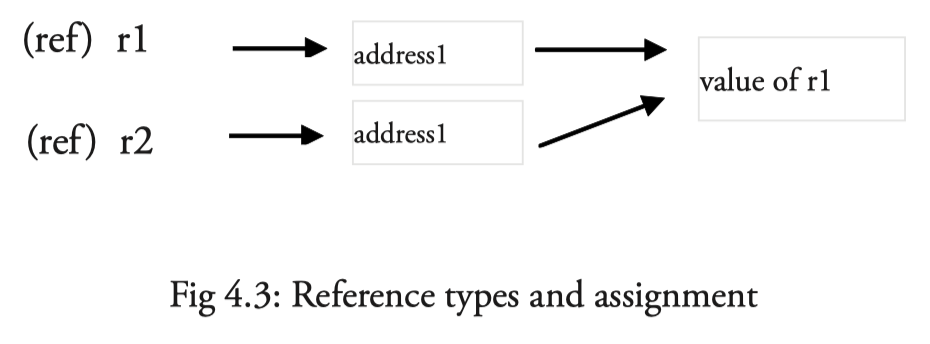
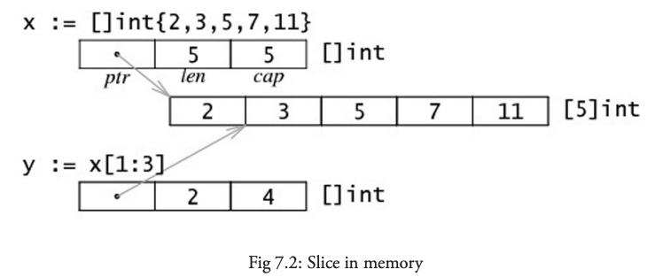
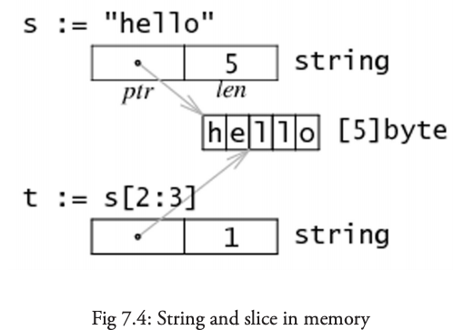

# Go

## Table of Contents

- [1. Brainstorming](#1-brainstorming)
- [2. Basic](#2-basic)
	- [2.1 Execution](#21-execution)
	- [2.2 Variables](#22-variables)
		- [2.2.1 Value Types](#221-value-types)
		- [2.2.2 Reference Types](#222-reference-types)
	- [2.3 Control Structures](#23-control-structures)
- [3. Slices](#3-slices)
- [References](#references)

## 1. Brainstorming

> No unnecessary code!

<div align="center">  </div><br>

## 2. Basic

### 2.1 Execution

**The order of execution**

<div align="center">  </div><br>

1. 入口：*package main*，按顺序 *import* 所有包
2. 递归地 *import*（每个包只会 *import* 一次）
3. 所有 *const* 和 *variables* 将被赋值，调用 *init()*（若存在）
4. 执行 *main()*

### 2.2 Variables

#### 2.2.1 Value Types

**Primitives**

<div align="center">  </div><br>


#### 2.2.2 Reference Types

**赋值**


<div align="center">  </div><br>

**var.go**

```go
// global, package 层面
var s string

// 只能 function 层面
s := "hello, world"

// 声明相同类型的变量
var a, b, c int
```


**pointer**

- Working w/ *pointers* can reduce **memory usage** and increase efficiency

<div align="center">  </div><br>


### 2.3 Control Structures

**if-else w/ intialization**

```go
// value is only visible in if-else block
if value := process(data); value > max {
  ...
}
```
**testing for errors**

```go
// 初始化 & 赋值
value, err := pack1.Function1(param1)
if err != nil {
  // 错误处理
  fmt.Println("error msg")
  return err
}
// normal case
```

**multi-branches**

```go
switch {
case condition1:
  ...
case condition2:
  ...
default:
  ...
}
```

## 3. Slices

**底层**

<div align="center">  </div><br>

*slice* 本身就是地址

<div align="center">  </div><br>

**创建**

```go
// 1. 通过下标的方式获得数组或者切片的一部分
arr[0:3] or slice[0:3]
// 2. 使用字面量初始化新的切片
slice := []int{1, 2, 3}
// 3. 使用关键字 make 创建切片
slice := make([]int, 10)
```


<div align="center">  </div><br>

**扩容**

```go
// 1. 分配新的 slice
t := make([]byte, len(s), (cap(s)+1)*2) // +1 in case cap(s) == 0
// 2. 封装了 copy(dst, src []Type) 函数
for i := range s {
        t[i] = s[i]
}
// 3. 重新指向
s = t
```

**array of bytes**

<div align="center">  </div><br>


## References

- *The Way to Go*
- *The GO Programming Language*
- [Go Slices: usage and internals](https://blog.golang.org/slices-intro)
- [The Absolute Minimum Every Software Developer Absolutely, Positively Must Know About Unicode and Character Sets (No Excuses!)](https://www.joelonsoftware.com/2003/10/08/the-absolute-minimum-every-software-developer-absolutely-positively-must-know-about-unicode-and-character-sets-no-excuses/)
- [字符编码笔记：ASCII，Unicode 和 UTF-8](https://www.ruanyifeng.com/blog/2007/10/ascii_unicode_and_utf-8.html)