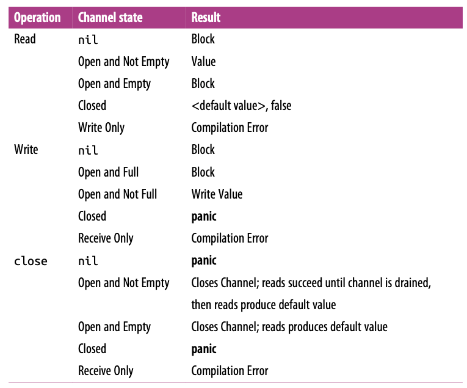

# Go

## Table of Contents

* [1. Basic](#1-basic)
  + [1.1 Execution](#11-execution)
  + [1.2 Variables](#12-variables)
    - [1.2.1 Zero-value Mechanism](#121-zero-value-mechanism)
    - [1.2.2 Lifetime](#122-lifetime)
  + [1.3 Type](#13-type)
  + [1.4 Slices](#14-slices)
  + [1.5 Maps](#15-maps)
  + [1.6 Structs](#16-structs)
* [2. Concurrency](#2-concurrency)
  + [2.1 Concurrency VS Parallelism](#21-concurrency-vs-parallelism)
  + [2.2 Channels](#22-channels)
* [References](#references)


## 1. Basic

### 1.1 Execution

**The order of execution**

<div align="center">  </div><br>

**init()**

```go
var WhatIsThe = AnswerToLife()

func AnswerToLife() int {
    return 42
}

func init() {
    WhatIsThe = 0
}

func main() {
    if WhatIsThe == 0 {
        fmt.Println("It's all a lie.")
    }
}
```

### 1.2 Variables

#### 1.2.1 Zero-value Mechanism

```go
var name type = expression
```


|                             Type                             | Zero-value |
| :----------------------------------------------------------: | :--------: |
|                           Numbers                            |     0      |
|                           Booleans                           |   False    |
|                           Strings                            |     ""     |
|                          Interface                           |    nil     |
| Reference types<br />(slice, pointer, map, channel, function) |    nil     |

#### 1.2.2 Lifetime

// todo


### 1.3 Type

```go
type name underlying-type
```


### 1.4 Slices

**struct**

<div align="center">  </div><br>

**grow**

<div align="center">  </div><br>


<div align="center">  </div><br>

**make new slice**

```go
// 避免修改原 slice 的底层数组
newSlice := originSlice[i:j:j]
```

### 1.5 Maps

// todo

### 1.6 Structs

**new**

<div align="center">  </div><br>

**embedded**

<div align="center">  </div><br>


**inherit**

```go
// 同一个包下, 子类可以访问父类的字段和方法
type Child struct {
  Father, // 匿名类
  Mother, // 匿名类
}
```


## 2. Concurrency

### 2.1 Concurrency VS Parallelism

Concurrency is a property of the code; parallelism is a property of the running program

### 2.2 Channels

> A channel serves as a conduit for a stream of information,
>
> values may be passed along the channel, and then read out downstream

**Channels & Goroutines**

<div align="center">  </div><br>

**Empty buffered channel**

<div align="center">  </div><br>

**Full buffered channel**

<div align="center">  </div><br>

**Partially full buffered channel**

<div align="center">  </div><br>

**Trouble shooting**

<div align="center">  </div><br>


## References

- *The Way to Go*
- *The GO Programming Language*
- *Go Web Programming*
- *Go in Action*
- [Go by Example](https://gobyexample.com/)
- [Go Slices: usage and internals](https://blog.golang.org/slices-intro)
- [The Absolute Minimum Every Software Developer Absolutely, Positively Must Know About Unicode and Character Sets (No Excuses!)](https://www.joelonsoftware.com/2003/10/08/the-absolute-minimum-every-software-developer-absolutely-positively-must-know-about-unicode-and-character-sets-no-excuses/)
- [Go 语言设计与实现](https://draveness.me/golang/)
- [Go maps in action](https://blog.golang.org/maps)
- [When is the init() function run?](https://stackoverflow.com/questions/24790175/when-is-the-init-function-run)
- [Concurrency is not Parallelism by Rob Pike](https://www.youtube.com/watch?v=oV9rvDllKEg)
- [50 Shades of Go: Traps, Gotchas, and Common Mistakes for New Golang Devs](http://devs.cloudimmunity.com/gotchas-and-common-mistakes-in-go-golang/)
