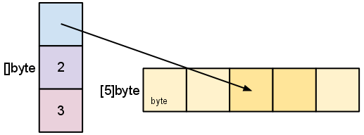

# Go

## Table of Contents

- [1. Basic](#1-basic)
	- [1.1 Execution](#11-execution)
	- [1.2 Composite Types](#12-composite-types)
		- [1.2.1 Value v.s Pointer](#121-value-vs-pointer)
		- [1.2.2 Fixed Size](#122-fixed-size)
		- [1.2.3 Dynamic](#123-dynamic)
- [2. Concurrency](#2-concurrency)
- [3. Web](#3-web)
- [References](#references)

## 1. Basic

### 1.1 Execution

**The order of execution**

<div align="center">  </div><br>

1. 入口：*package main*，按顺序 *import* 所有包
2. 递归地 *import*（每个包只会 *import* 一次）
3. 所有 *const* 和 *variables* 将被赋值，调用 *init()*（若存在）
4. 执行 *main()*

### 1.2 Composite Types

#### 1.2.1 Value v.s Pointer

**value**

<div align="center">  </div><br>

**pointer**

- Working w/ *pointers* can reduce **memory usage** and increase efficiency

<div align="center">  </div><br>


#### 1.2.2 Fixed Size

**Arrays**

<div align="center">  </div><br>


**Structs**


#### 1.2.3 Dynamic

**Slices**

<div align="center">  </div><br>

**len 与 cap 的关系**

```go
s = make([]byte, 5)
```


<div align="center">  </div><br>


```go
s = s[2:4]
```


<div align="center">  </div><br>

**append**

```go
t := make([]byte, len(s), (cap(s)+1)*2)  // 思考: 为什么 "+1"
copy(t, s)
s = t
```

**maps**


**底层**

<div align="center">  </div><br>

**嵌套**

<div align="center">  </div><br>


**继承**

```go
// 同一个包下, 子类可以访问父类的字段和方法
type Child struct {
  Father, // 匿名类
  Mother, // 匿名类
}
```


## 2. Concurrency

**Channels & goroutines**

<div align="center">  </div><br>


## 3. Web

**net/http 标准库**

<div align="center">  </div><br>


**Handling requests**

<div align="center">  </div><br>


## References

- *The Way to Go*
- *The GO Programming Language*
- *Go Web Programming*
- [Go by Example](https://gobyexample.com/)
- [Go Slices: usage and internals](https://blog.golang.org/slices-intro)
- [The Absolute Minimum Every Software Developer Absolutely, Positively Must Know About Unicode and Character Sets (No Excuses!)](https://www.joelonsoftware.com/2003/10/08/the-absolute-minimum-every-software-developer-absolutely-positively-must-know-about-unicode-and-character-sets-no-excuses/)
- [字符编码笔记：ASCII，Unicode 和 UTF-8](https://www.ruanyifeng.com/blog/2007/10/ascii_unicode_and_utf-8.html)
- [Gin Web Framework](https://github.com/gin-gonic/gin#gin-web-framework)
- [Go 语言设计与实现](https://draveness.me/golang/)
- [Go语言 | Go 1.9 新特性 Type Alias详解](https://www.flysnow.org/2017/08/26/go-1-9-type-alias.html)
- [Type assertions and type switches](https://yourbasic.org/golang/type-assertion-switch/)