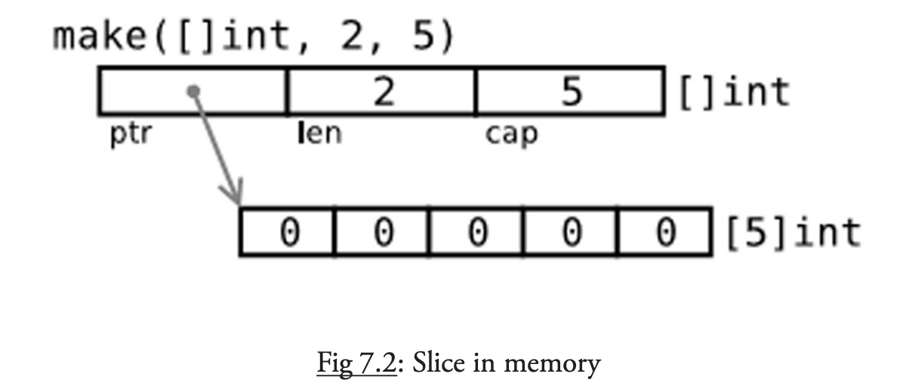

# Go

## Table of Contents

- [1. Brainstorming](#1-brainstorming)
- [2. Basic](#2-basic)
	- [2.1 Execution](#21-execution)
	- [2.2 Variables](#22-variables)
		- [2.2.1 Value Types](#221-value-types)
		- [2.2.2 Reference Types](#222-reference-types)
	- [2.3 Control Structures](#23-control-structures)
	- [2.4 Slices](#24-slices)
	- [2.5 Maps](#25-maps)
	- [2.6 Structs](#26-structs)
	- [2.7 Interface](#27-interface)
	- [2.8 Reflection](#28-reflection)
	- [2.9 Testing](#29-testing)
- [References](#references)

## 1. Brainstorming

> No unnecessary code!

<div align="center">  </div><br>

## 2. Basic

### 2.1 Execution

**The order of execution**

<div align="center">  </div><br>

1. 入口：*package main*，按顺序 *import* 所有包
2. 递归地 *import*（每个包只会 *import* 一次）
3. 所有 *const* 和 *variables* 将被赋值，调用 *init()*（若存在）
4. 执行 *main()*

### 2.2 Variables

#### 2.2.1 Value Types

**Primitives**

<div align="center">  </div><br>


#### 2.2.2 Reference Types

**赋值**


<div align="center">  </div><br>

**var.go**

```go
// global, package 层面
var s string

// function 层面
s := "hello, world"

// 并列声明/赋值
var a, b, c int
```


**pointer**

- Working w/ *pointers* can reduce **memory usage** and increase efficiency

<div align="center">  </div><br>


### 2.3 Control Structures

**if-else w/ intialization**

```go
// value is only visible in if-else block
if value := process(data); value > max {
  ...
}
```
**testing for errors**

```go
// 初始化 & 赋值
value, err := pack1.Function1(param1)
if err != nil {
  // 错误处理
  return err
}
// normal case
```

**multi-branches**

```go
switch {
case condition1:
  ...
case condition2:
  ...
default:
  ...
}
```

### 2.4 Slices

**底层**

<div align="center">  </div><br>

*slice* 本身就是地址

<div align="center">  </div><br>

**创建**

```go
// 获得数组或者切片的一部分
arr[0:3] or slice[0:3]

// 字面量
slice := []int{1, 2, 3}

// 关键字 make
slice := make([]int, 10)
```


<div align="center">  </div><br>

**扩容**

```go
// 1. 分配新的 slice
t := make([]byte, len(s), (cap(s)+1)*2) // +1 in case cap(s) == 0

// 2. 封装了 copy(dst, src []Type) 函数
for i := range s {
        t[i] = s[i]
}

// 3. 重新指向
s = t
```

**array of bytes**

<div align="center">  </div><br>


### 2.5 Maps

**创建**

```go
// 若 key 不存在, 则 val 为同类型的默认值
mapLit := map[string]int{"one": 1, "two": 2}

// 分配新的内存空间
mapCreated := make(map[string]float32)

// 相同内存地址
mapAssigned := mapLit
```

**测试 key 是否存在**

```go
if val, isPresent := mapCreated[key]; isPresent {
  // code
}
```

### 2.6 Structs

**底层**

<div align="center">  </div><br>

**创建**

```go
// value type 
var ms1 myStruct

// pointer: 为该类型分配内存空间, 并返回指针
ms2 := new(myStruct)

// 作为 pointer 的另一种形式
ms3 := &myStruct{"field": val}
```

**嵌套**

<div align="center">  </div><br>


**继承**

```go
// 同一个包下, 子类可以访问父类的字段和方法
type Child struct {
  Father, // 匿名类
  Mother, // 匿名类
}
```

### 2.7 Interface

**接口变量**

<div align="center">  </div><br>


### 2.8 Reflection

**第一法则**

将 *interface{}* 变量转换成反射对象（函数调用是值传递）

**第二法则**

从反射对象获取 *interface{}* 变量

**第三法则**

值是否可以被更改

### 2.9 Testing

**Error handling**

```go
if value, err := pack1.Func1(param1); err != nil {
  fmt.Printf("Error %s in pack1,Func1 with parameter %v", err.Error(), para1)
  // or: return err
  return 
}
Process(value)
```


## 3. Concurrency

### 3.1 Channel

<div align="center">  </div><br>


## References

- *The Way to Go*
- *The GO Programming Language*
- [Go Slices: usage and internals](https://blog.golang.org/slices-intro)
- [The Absolute Minimum Every Software Developer Absolutely, Positively Must Know About Unicode and Character Sets (No Excuses!)](https://www.joelonsoftware.com/2003/10/08/the-absolute-minimum-every-software-developer-absolutely-positively-must-know-about-unicode-and-character-sets-no-excuses/)
- [字符编码笔记：ASCII，Unicode 和 UTF-8](https://www.ruanyifeng.com/blog/2007/10/ascii_unicode_and_utf-8.html)
- [Gin Web Framework](https://github.com/gin-gonic/gin#gin-web-framework)
- [Go 语言设计与实现](https://draveness.me/golang/)
- [Go语言 | Go 1.9 新特性 Type Alias详解](https://www.flysnow.org/2017/08/26/go-1-9-type-alias.html)
- [Type assertions and type switches](https://yourbasic.org/golang/type-assertion-switch/)